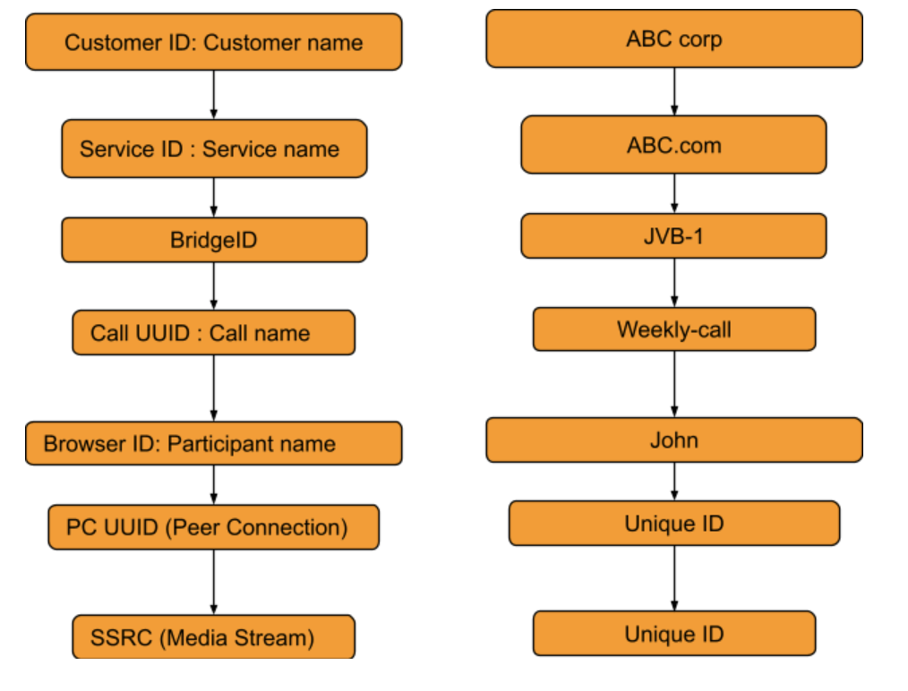

 Observer Documentation 
===

# Introduction

WebRTC-Observer is a microservice written in Java to collect and analyze 
measurements originated by WebRTC Applications. It is designed to be a 
monitoring solution for WebRTC Applications scalable 
from a single, local development up to a large kubernetes cluster.  

This document is written for version named [hydrogen](https://github.com/ObserveRTC/observer/releases/tag/hydrogen)


# Architecture


In our architectural model, the observer takes place as a 
processing element, capable of accepting samples from the 
collecting components, and can forward reports to a Data Sink.

You can read a detailed description about the architecture 
in our [main](http://observertc.org) page.

The service is written in Java, using [micronaut](https://micronaut.io) 
framework to implement the observer business logic, 
and [hazelcast](https://hazelcast.org) in-memory-data-grid is used 
to share data between service components, and instances.

## Data Hierarchy




The accepted samples by the observer contains a data hierarchy 
in order to group and route them.

**service**: The highest-level hierarchy entity in our data hierarchy.
`Service` indicates an organization with several possible media 
service they want to monitor under the same group.

**media unit**: The `media unit` indicates an entity 
belongs to a `service`. It can indicate a different 
bridge server the clients are joined to, or a different environment 
(test / prod) the accepted samples belong to. The concrete 
choice how to organize it is a matter of taste, but it is important 
to remember that relation between `service` and `media unit` is `1:N`.

**call**: incoming samples are grouped together to a call entity. 
A call identify a number of peer connections that shares the
same `call name` or the same id of `SSRC`s.  

**peer connection** refers to the peer connection in the client side 
the rtc stats originated from. 

**SSRC** Peer connections have RTP streams, and each RTP stream 
has an SSRC, which is used to send a spcific stream. 
For instance one peer connection uses an SSRC to send video, the 
same SSRC (if we are talking about a strict peer to peer connection terms) 
will occur at the receiver side identifying the stream the sender 
transmit.

# Application Programming Interfaces (API)

The observer is responsible to provide interfaces for the following operations:

* Accept samples
* Provide metrics
* Forward reports
* Control configurations

## Accept Samples

THe service can listen for samples on various 
inputs (e.g. websocket server), and samples are accepted if 
the invoked input validate the provided sample.

The following schemas are accepted as inputs:
 * [Peer Connection Samples](###peer-connection-sample)

### Peer Connection Sample

The peer connection sample multiplexes 
webrtc stats metrics, client details, and user media informations.

Clients providing Peer Connection Samples: 
 * [observer-js](https://github.com/ObserveRTC/observer-js)

#### Version: 20200114

 * [Schema description](pcsample-v20200114.md)
 * [Json Schema]()


### Sample Listeners

The observer listens for accepting samples as follows: 

#### Websockets

Schema: [Peer Connection Sample](#peer-connection-sample) **Version**: 20200114:
 * ws(s)://{HOST}:{PORT}/{serviceUUID}/{mediaUnitId}/v20200114/json

## Provided Metrics

The observer monitors the incoming samples and expose metrics.
The metrics are exposed using [micrometer](https://micrometer.io/) plugin in
[micronaut](https://micronaut-projects.github.io/micronaut-micrometer/latest/guide/index.html#introduction)
framework.

### Integrations


All integration with the supported
metrics' server is possible via a proper micronaut configuration, which
is part of the observer (or observer part of micronaut it is a matter
of perspective).

The default integration this version is compiled is the [prometheus](https://micronaut-projects.github.io/micronaut-micrometer/latest/guide/index.html#prometheus)
integration.

### General Metrics

General metrics are enabled by default, and provides an overall state of the service.

|          Metric Name         |   Type  |                                                  Description                                                  |          Tags          |
|:----------------------------:|:-------:|:-------------------------------------------------------------------------------------------------------------:|:----------------------:|
| observertc_opened_websockets | Counter | Indicates the number of opened websocket                                                                      |  -                     |
| observertc_closed_websockets | Counter | Indicates the number of closed websocket                                                                      |  -                     |
| observertc_pcsamples         | Counter | Indicates the number of peer connection samples received by the service                                       | mediaUnit, serviceName |
| observertc_generated_reports | Counter | Indicates the number of WebRTC-Reports generated by the service from the incoming samples                     | serviceName, [^1]      |
| observertc_user_media_errors | Counter | Indicates the number of user media errors reported by the samples                                             | serviceName, [^2]      |
| observertc_initiated_calls   | Counter | Indicates the number of calls identified and initiated by the observer                                        | service, mediaunit     |
| observertc_finished_calls    | Counter | Indicates the number of calls identified and finished by the observer                                         | service, mediaunit     |
| observertc_joined_pcs        | Counter | Indicates the number of peer connections joined to the observer                                               | service, mediaunit     |
| observertc_detached_pcs      | Counter | Indicates the number of peer connections detached from the observer                                           | service, mediaunit     |
| observertc_impairable_pcs    | Counter | Indicates the number of peer connections the observer skips to join to any call due to missing its parameters | service, mediaunit     |
| Flaws_monitor                | Counter | Indicates the number of errors reported by various part of the system.                                        | klass                  |


**[^1]**: configuration can extended it with serviceUUID, and reportType tags.

**[^2]**: configuration can extended it with serviceUUID tag.


### Sentinel Metrics

|                Metric Name                |   Type  |                                                Description                                                |         Tags        |
|:-----------------------------------------:|:-------:|:---------------------------------------------------------------------------------------------------------:|:-------------------:|
| observertc_monitored_ssrcs_num            | Gauge   | Indicates the total number of SSRC calls counted by a sentinel over matching calls                        | sentinel            |
| observertc_monitored_pcs_num              | Gauge   | Indicates the total number of Peer Connections counted by a sentinel over matching calls                  | sentinel            |
| observertc_monitored_calls_num            | Gauge   | Indicates the total number of Calls counted by a sentinel over matching operation                         | sentinel            |
| observertc_monitored_media_units          | Counter | Indicates the number of media units a sentinel encounted during matching operation                        | sentinel, mediaUnit |
| observertc_monitored_browser_ids_num      | Gauge   | Indicates the total number of browser ids counted by a sentinel over matching operation                   | sentinel            |
| observertc_monitored_user_names_num       | Gauge   | Indicates the total number of user names counted by a sentinel over matching operation                    | sentinel            |
| observertc_monitored_bytes_received[^1]   | Gauge   | Indicates the sum of bytes received on peer connections a sentinel have found over a matching operation   | sentinel            |
| observertc_monitored_packets_received[^1] | Gauge   | Indicates the sum of packets received on peer connections a sentinel have found over a matching operation | sentinel            |
| observertc_monitored_packets_lost[^1]     | Gauge   | Indicates the sum of packets lost on peer connections a sentinel have found over a matching operation     | sentinel            |
| observertc_monitored_bytes_sent[^2]       | Gauge   | Indicates the sum of bytes sent on peer connections a sentinel have found over a matching operation       | sentinel            |
| observertc_monitored_packets_sent[^2]     | Gauge   | Indicates the sum of packets sent on peer connections a sentinel have found over a matching operation     | sentinel            |
| observertc_monitored_rtt[^3]              | Summary | Indicates the RTT of SSRCs a sentinel have found over a matching operation                                | sentinel            |

**[^1]**: Only exposed if inboundRTPMonitor is enabled

**[^2]**: Only exposed if outboundRTPMonitor is enabled

**[^3]**: Only exposed if remoteInboundRTPMonitor is enabled

## Forwarded Reports

Observer forward reports based on the incoming samples. Reports are either 
part of the incoming samples, like WebRTCStats measurements, or a generated event 
deducted from the samples, like a group of peer connection belonging to the same 
`call`.

Although the encoder component in the sink

### Client Sample Related Reports

**InboundRTP Report**

### Generated Reports

**Initiated Call Report**

**Finished Call Report**

**Joined Peer Connection**

**Detached Peer Connection**

**Observer Events**


## Controlling Endpoints

REST API endpoints are provided to control some configurations of the observer
dynamically.

# Sentinels

The observer applies sentinels to monitor peer connections and calls.
A Sentinel filters all calls' and all peer connections going through 
the observer and watches the ones matching for its defined criteria. 
Properties of the watched calls and peer connections are accumulated and metrics are exposed.

Sentinels are designed to watch certain subset of the calls and peer connections, and 
providing useful metrics. Just like WebRTCStats metrics are useless if you do not know 
what you are looking for, or what do you want to measure. We give a few practical examples 
how to use sentinels for different scenarios in the [Example](#examples-for-sentinels) subsection.

A Sentinel uses a collection of `call filters` and `peer connection filters` 
to decide if a call is watched or not.

```json5
{
  "expose": true,
  "name": "MySentinel",
   // list the filters for calls. 
   "callFilters": {
        // the allMatch part of the filter matches if all of the filters listed below are match
        "allMatch": [],
        // the anyMatch part of the filter matches if any of the filters listed below are match
        "anyMatch": []
   },
  "pcFilters": {
        // the allMatch part of the filter matches if all of the filters listed below are match
        "allMatch": [],
        // the anyMatch part of the filter matches if any of the filters listed below are match
        "anyMatch": []
  },
}
```

### Filters

The main building component of a sentinel is a filter. Filter itself does not exists, 
it is an abstract element inside the program, but this element is used to define 
criteria. We define a filter element as follows:

```json5
{
  "filter": {
    "allMatch": [],
    "anyMatch": []
  },  
}
```
The filter element has two array type attributes: `allMatch`, and `anyMatch`.
Every listed item in the allMatch must be evaluated true in order the `allMatch` part to be true in the filter.
Contrary, the `anyMatch` part is evaluated to be true if any of the item listed there is evaluated to be true.
A filter is evaluated as true if the two parts are evaluated as true. If the attribute is an empty array, 
that part always evaluated to be true.

Example:

Lets define a filter for collections as follows:

```json
{"MyFilter": { "allMatch": ["a", "b"], "anyMatch": ["c", "d"] } }
```
Applying the above filter for the following collection (the result of the evaluation is in comments)
```shell
["a", "b", "c"] # True
["a", "b", "d"] # True
["a", "c", "d"] # False
["b", "c", "d"] # False
```

Different type of filters are inherited manifestation of the above defined abstract element, 
which are used to define what we want to filter for a sentinel. Filters can be embedded into another filter.
For instance we can gave filter names to the `anyMatch` attribute of a filter, which means 
the actual filter matches if any of the filter listed there matches.
In the following we define the different type of filters and in the end we give examples how to use them.

**Collection Filter**: Collection filter is a building block for actual filters for sentienl. 
They are part of `Call Filters` and `Peer connection filters` and this is why we need to describe beforehand.

A collection filter is defined as follows:
```json5
{
  // the size of the collection is equal to the given value
  "eq": -1, // -1 is the default, which means it is not given by the user
  
  //the size of the collection is greater than the given value 
  "gt": -1, // -1 is the default, which means it is not given by the user

  //the size of the collection is less than the given value 
  "lt": -1, // -1 is the default, which means it is not given by the user

  // evaluated as true if any of the item in the collection matches
  anyMatch: [], // the default is an empty array

  // evaluated as true if all of the item in the collection matches
  allMatch: []  // the default is an empty array
}
```

**Call Filters**: 

```json5
{
  name: "CallFilterName",
  marker: "", // a regex expression or empty for the marker of the samples
  serviceName: "", // a regex expression or empty for the service name of the samples
  callName: "", // a regex expression or empty for the service name of the samples
  browserIds: {}, // a collection filter
  peerConnections: {}, // a collection filter
}
```

**Peer Connection Filters**:
```json5
{
  name: "PCFilterName",
  marker: "", // a regex expression or empty for the marker of the samples
  serviceName: "", // a regex expression or empty for the service name of the samples
  callName: "", // a regex expression or empty for the service name of the samples
  remoteIPs: {}, // a collection filter
  SSRCs: {}, // a collection filter
}
```

### Examples for Sentinels

#### Watch peer to peer connections

In this example we want to watch all calls have two participants communicate to each other.
For this we need to create a call filter matches with calls have exactly two different participants, 
and then we need to define a sentinel applies that filter in every check.

```json5
{
  name: "PeerToPeerCallsFilter",
  browserIds: {
    eq: 2
  }
}
```
We define a call filter matches with calls have exactly two browserIds. BrowserIds are 
the fingerprint of browser added to every sample incoming to the observer. It ensures 
the filter matches the calls have at least two different browsers. 

NOTE: you can setup the filter to matches the calls have exactly two peer connections, 
but keep in mind that certain client integration may uses more than 2 RTCPeerConnection 
in their peer to peer connections.

Next we need to define a sentinel applies our defined call filter.

```json5
{
  "expose": true,
  "name": "MyP2PSentinel",
  "callFilters": {
    "anyMatch": ["PeerToPeerCallsFilter"]
  },
}
```

As you see the sentinel references the previously defined call filter by its name.

Defining Filters and Sentinels can be done through the application API controlling endpoints 
for configurations, or putting giving a configuration through a yaml at bootstrap.
For the latter here is the snippet in yaml what you can use:

```yaml
# Add a call filter for peer to peer calls
  callFilters:
    - name: "MyPeerToPeerFilter"
      browserIds:
        eq: 2 
  
  # Configure a sentinel for your turn servers used by peer to peer calls
  # and expose metrics
  sentinels:
    - name: "MySentinel"
      expose: true 
      callFilters:
        anyMatch: 
          - "MyPeerToPeerFilter"
```

#### Watch Calls using TURN 

In this example we want to watch all peer connections using TURN server 
to resolve their IP addresses. 

```json5
{
  name: "MyTurnServersFilter",
  remoteIPs: {
    anyMatch: [
      "10.10.10.10",
      "20.20.20.20"
    ]
  }
}
```

First we create a filter matches for any peer connection targeted the turn server in their 
remote ICE candidates. Once we have registered this filter we can create the sentinel 
applies it.

```json5
{
  "expose": true,
  "name": "MyTURNSentinel",
  "pcFilters": {
    "anyMatch": ["MyTurnServersFilter"]
  },
}
```

Defining Filters and Sentinels can be done through the application API controlling endpoints
for configurations, or putting giving a configuration through a yaml at bootstrap.
For the latter here is the snippet in yaml what you can use:

```yaml
# Add a call filter for peer to peer calls
  pcFilters:
    - name: "MyTurnServersFilter"
      pcFilters:
        anyMatch: 
          - "10.10.10.10"
          - "20.20.20.20"
  
  # Configure a sentinel for your turn servers used by peer to peer calls
  # and expose metrics
  sentinels:
    - name: "MyTURNSentinel"
      expose: true 
      pcFilters:
        anyMatch: 
          - "MyTurnServersFilter"
```

# Connectors

Connectors are used to connect the observer [generated reports](#forwarded-reports) to 
another service inputs. Connectors are described in the bootstrap [configration](#observer-configuration) 
loaded by the service at startup. 

An Observer may initialize many connectors and attach them 

A connector object can be described as follows:

```yaml
name: "MyConnectorName"  # required
transformations: []      # optional
encoder: {}              # optional
buffer: {}               # optional
sink: {}                 # required
```
**Name**: Every connector must have a name, identifying it in the logging mechanism.

**Transformations**: A connector may have transformations, such as 
Filter, or Obfuscator. Transformations are optional.

**Encoder**: Specifies the encoding from an inner Report format 
to the sink accepted byte array format with optional meta information.
The default encoder is AvroEncoder.

**Buffer**: A buffer takes place between the observer
inner pipeline forwarded report and the sink. 

**Sink**: Sinks are the client library integration 
in the observer to forward the generated reports to. 

An example configuration for a connector inside the 
`connectors` in the observer configuration.
```yaml
connectors:
  - name: "MyKafkaSink"
    tranformations:
      - type: Filter
        config:
          serviceName:
            including:
              - "MyService"
    encoder:
      type: AvroEncoder
      config:
        addMetaKey: True
    buffer:
      maxItems: 100
      maxWaitingTimeInS: 30
    sink:
      type: "Kafka"
      config:
        topic: "my-service-reports"
        properties:
          bootstrap.servers: "my-kafka:9092"
```
In the configuration above we made a connector named 
__MyKafkaSink__ and applied a filter to only allow serviceNames 
including __MyService__ to be forwarded. Next we configured the buffer 
to emit reports on the sink if it has either 100 items, or 
waiting for 30s. Last we configured the sink itself, which is a kafkasink.


# Configuration

## Observer Configuration

The following configuration serves as a reference configuration
for this version in `yaml` format with comments
explaining (more or less) what that configuration is intended
to setup.

The configuration must be parsed by the service engine framework
([micronaut](https://micronaut.io)), thus it should be placed
one of the config file it loads (e.g.: `application.yaml`). 

```yaml
observer:
  
  # Setup security configuration specific to the observer service
  security:
    # Drop Peer Connection Samples, for which the service uuid does not match any service name
    dropUnknownServices: False
  
  # Sets up the mapping between service UUID and service Name.
  servicemappings:
    - name: "example-service-name"
      uuids:
        - "aaaaaaaa-bbbb-cccc-dddd-eeeeeeeeeeee"

  # if enabled the generated reports from the observer 
  # are monitored and the metrics are exposed.
  reportMonitor:
    enabled: true
    tagByServiceName: true
    tagByServiceUUID: false
    tagByType: false

  # if enabled the incoming user media errors are monitored  
  # and the metrics are exposed.
  userMediaErrorsMonitor:
    enabled: true
    tagByServiceName: true
    tagByServiceUUID: false
  
  # if enabled IP addresses are obfuscated
  ipAddressConverter:
    enabled: False
    algorithm: SHA-256
    salt: "MySalt"

  # If enabled the observer monitors inbound RTP traffic, 
  # and through sentinels it exposes metrics (received bytes, 
  # lost packets, etc.)
  # 
  inboundRtpMonitor:
    enabled: False
    retentionTimeInS: 300

  # If enabled the observer monitors remote inbound RTP traffic, 
  # and through sentinels it exposes metrics (RTT, etc.)
  # 
  remoteInboundRtpMonitor:
    enabled: True
    retentionTimeInS: 300
    weightFactor: 0.3

  # If enabled the observer monitors outbound RTP traffic, 
  # and through sentinels it exposes metrics (sent bytes, 
  # sent packets, etc.)
  # 
  # NOTE: this increase memory storage consumption and 
  # hazelcast traffic
  outboundRtpMonitor:
    enabled: True
    retentionTimeInS: 300  

  # Sets a filter for peer connections
  pcFilters:
    - name: "MyTurnServerFilter"
      remoteIPs:
        anyMatch: 
          - "10.10.10.10"
          - "20.20.20.20"
  
  # Add a call filter for peer to peer calls
  callFilters:
    - name: "MyPeerToPeerFilter"
      browserIds:
        eq: 2 
  
  # Configure a sentinel for your turn servers used by peer to peer calls
  # and expose metrics
  sentinels:
    - name: "MySentinel"
      expose: true 
      callFilters:
        allMatch: 
          - "MyPeerToPeerFilter"
      pcFilters:
        allMatch:
          - "MyTurnServerFilter"
  
  
  # The time Period sentinels are checking calls in minutes
  sentinelsCheckingPeriodInMin: 1
  
  
  # Defines the configuration for a connector the reports are sent to
  connectors:
    - name: "ReportSinkLogger"
      buffer:
        maxItems: 100
        maxWaitingTimeInS: 10
      sink:
        type: LoggerSink
        config:
          printReports: False

  # Sets up the Evaluators every incoming sample is subjected
  evaluators:
    
    # name of the calls, which cannot be paired (nor SSRC, neither call name was provided to match)
    impairablePCsCallName: "impairable-peer-connections-default-call-name"
    
    # The incoming sample buffer maximum waiting time before emission
    observedPCSBufferMaxTimeInS: 10
    
    # The incoming sample buffer maximum amount of items it can hold
    observedPCSBufferMaxItemNums: 10000
    
    # The maximum idle time for a peer connection before it is declared to be detached.
    peerConnectionMaxIdleTimeInS: 60
  
  # Sets up which type of webrtc reports the service can forward
  outboundReports:
    reportOutboundRTPs: True
    reportInboundRTPs: True
    reportRemoteInboundRTPs: True
    reportTracks: True
    reportMediaSources: True
    reportCandidatePairs: True
    reportLocalCandidates: True
    reportRemoteCandidates: True
    reportUserMediaErrors: True
    
  # Sets up the hazelcast configuration file
  hazelcast:
    configFile: ${HAZELCAST_CONFIG_FILE:`classpath:hazelcast.yaml`}
```

# Known Limitations

The following limitations are known to this version


# Implementation Details

## Evaluator Pipeline

The inner pipeline of the service is described in the `Pipeline` class.

### Input format

The Pipeline accepted input format is `ObservedPCS` object.


# Contributors

* [Balazs Kreith](https://github.com/balazskreith)
* [Pallab Gain](https://github.com/pallab-gain)

# Licenses

